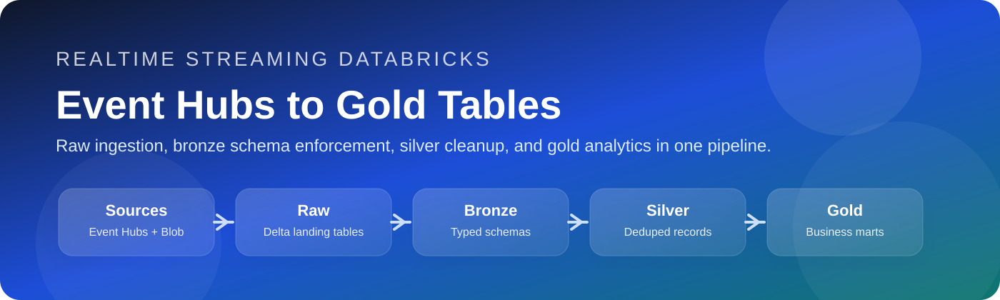
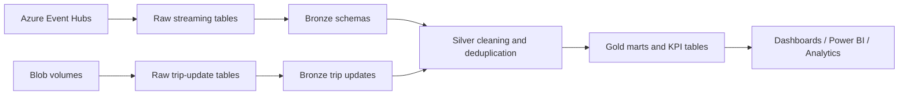

# Realtime Streaming Databricks

This repository is a Databricks medallion-style streaming pipeline for Toronto transit data. It ingests live Event Hubs traffic and blob-based trip updates, normalizes the payloads into bronze tables, cleans and deduplicates them in silver, and builds business-ready gold tables for reporting and operational analysis.

The project is organized around four layers:

1. Raw, where the original streaming payloads are captured with minimal transformation.
2. Bronze, where the JSON payloads are parsed into typed columns.
3. Silver, where bad records are removed and duplicates are reduced to the latest version.
4. Gold, where analytic tables are built for dashboards, Power BI, and downstream consumers.

## Pipeline Map

## What Is In The Repo

- [databricks.yml](databricks.yml) defines the Databricks bundle, the shared cluster configuration, and the one orchestrated job in this repo.
- [requirements.txt](requirements.txt) is currently empty, which means the notebooks rely on the Databricks runtime and built-in Spark libraries rather than pinned Python packages.
- The notebooks under [src/raw](src/raw), [src/bronze](src/bronze), [src/silver](src/silver), and [src/Gold](src/Gold) implement the actual pipeline stages.

## End-To-End Flow

The pipeline is built to move data in this order:

1. Event Hubs and blob storage feed the raw layer.
2. Raw tables store the incoming payloads plus ingestion metadata.
3. Bronze notebooks parse each payload into a strongly typed schema.
4. Silver notebooks filter invalid rows and keep only the latest version of each business record.
5. Gold notebooks join transit, alert, vehicle, and weather data into curated analytics tables.

The result is a layered dataset that keeps raw fidelity at the start and gradually becomes more opinionated and dashboard-friendly downstream.

## Databricks Bundle

The bundle in [databricks.yml](databricks.yml) is centered on a single ingestion job called `ingestion_pipeline`.

### Cluster configuration

The shared job cluster is configured as a single-node runtime:

- Spark version: `16.4.x-scala2.12`
- Node type: `Standard_D2ads_v6`
- Workers: `0`
- Security mode: `SINGLE_USER`
- Master: `local[*]`

The cluster also sets a few safety and convenience options:

- `spark.sql.files.ignoreMissingFiles = true` to reduce failures from missing files.
- `ResourceClass = SingleNode` to mark the cluster type.
- A single-user identity tied to the workspace owner.

### Targets

There are two deployment targets:

- `dev`, which is marked as the default target and points to the development catalog.
- `prod`, which switches the catalog name to production.

### Orchestrated job

The only job currently wired into the bundle is the raw ingestion pipeline. It runs three notebook tasks:

- `streaming_ingest` for Event Hubs weather, alerts, and vehicle positions.
- `micro_batch_ingest` for active subminute trip-update files.
- `batch_ingest` for completed trip-update files.

The bronze, silver, and gold notebooks exist as the downstream transformation layers, but they are not wired into the bundle as separate jobs yet.

## Raw Layer

### 1. Ingest the streaming data

[src/raw/1. Ingest the streaming data.ipynb](src/raw/1.%20Ingest%20the%20streaming%20data.ipynb) connects Databricks to Azure Event Hubs and starts three streaming reads at once.

What the code does:

- Imports `json`, `datetime`, and Pandas helpers needed for connection and timestamp handling.
- Builds a shared Event Hubs connection string from a secret-backed SAS token stored in Key Vault.
- Defines a reusable `get_event_hub_config()` helper that can start from the latest offset, the beginning, or a custom ISO timestamp.
- Creates one configuration each for weather, service alerts, and vehicle positions.
- Reads each Event Hubs stream with `spark.readStream.format("eventhubs")`.
- Casts the binary Event Hubs `body` field into a readable string column called `body_str`.
- Adds an `ingested_at` timestamp so later layers can reason about freshness and deduplication.
- Writes each stream into a Delta raw table with a dedicated checkpoint and query name.

Purpose:

- Preserve the original streaming payload with minimal shaping.
- Keep the ingestion path separate for each source so failures and replay behavior are isolated.
- Create stable raw tables that downstream notebooks can read as streams.

Outputs:

- `dev.raw.weather_raw`
- `dev.raw.ttc_alerts_raw`
- `dev.raw.ttc_vehicle_positions_raw`

### 2. Micro Batch Ingest the streaming blob data

[src/raw/2. Micro Batch Ingest the streaming blob data.ipynb](src/raw/2.%20Micro%20Batch%20Ingest%20the%20streaming%20blob%20data.ipynb) uses Auto Loader to ingest the active trip-update blob volume on a 30-second cadence.

What the code does:

- Imports `json`, `time`, Spark functions, and `reduce` for ingestion setup.
- Points Auto Loader at the active subminute blob path.
- Tracks schema evolution in a schema location folder.
- Uses `_rescued_data` to retain malformed or unexpected fields instead of dropping them.
- Adds `_source_file`, `_ingest_ts`, and `_ingest_date` for traceability.
- Writes append-only rows to a Delta table through a streaming query.
- Uses a `30 seconds` trigger so the pipeline behaves like a micro-batch feed.
- Prevents duplicate streams by checking whether the query is already active.

Purpose:

- Capture near-real-time trip updates from blobs without waiting for full file completion.
- Keep schema drift visible and survivable.
- Preserve file lineage so raw events can be traced back to their source file.

Outputs:

- `dev.raw.ttc_trip_updates_raw_microbatch`

### 3. Batch Ingest the streaming blob data

[src/raw/3. Batch Ingest the streaming blob data.ipynb](src/raw/3.%20Batch%20Ingest%20the%20streaming%20blob%20data.ipynb) is the batch-oriented companion to the micro-batch notebook.

What the code does:

- Uses the same Auto Loader pattern and the same JSON schema tracking strategy.
- Reads from the completed blob volume instead of the active subminute volume.
- Adds file and ingestion metadata in the same way as the micro-batch notebook.
- Writes to a separate Delta raw table so the two ingest modes do not overwrite each other.
- Uses an hourly trigger to process the currently available completed files in larger chunks.

Purpose:

- Capture the finalized file set with a lower-frequency ingest path.
- Complement the micro-batch pipeline with a more stable completed-file feed.
- Keep the raw stream separated by ingest pattern so downstream processing can choose the right source.

Outputs:

- `dev.raw.ttc_trip_updates_raw_batch`

## Bronze Layer

The bronze notebooks all follow the same pattern: read the raw Delta table as a stream, parse the JSON payload with an explicit schema, rename fields into analytics-friendly columns, and write to a bronze Delta table.

### 4. Imposing schema - vehicle position

[src/bronze/4. Imposing schema - vehicle position.ipynb](src/bronze/4.%20Imposing%20schema%20-%20vehicle%20position.ipynb) normalizes the vehicle-position event feed.

What the code does:

- Reads `dev.raw.ttc_vehicle_positions_raw` as a stream.
- Defines a nested schema for the Event Hubs payload.
- Parses `body_str` into a structured `payload` object.
- Flattens the nested fields into typed columns like `vehicle_id`, `trip_id`, `route_id`, `latitude`, `longitude`, `speed`, and `current_status`.
- Converts the Unix event timestamp into a real Spark timestamp.
- Preserves the raw `ingested_at` timestamp.
- Appends the result to `dev.bronze.ttc_vehicle_positions_bronze`.

Purpose:

- Turn opaque JSON into a reliable typed table.
- Make the feed usable for deduplication, geospatial analysis, and fleet tracking.

Output:

- `dev.bronze.ttc_vehicle_positions_bronze`

### 5. Imposing schema - alerts

[src/bronze/5. Imposing schema - alerts.ipynb](src/bronze/5.%20Imposing%20schema%20-%20alerts.ipynb) normalizes alert events from the raw alerts table.

What the code does:

- Reads `dev.raw.ttc_alerts_raw` as a stream.
- Defines a structured alert schema with route, stop, message, language, cause, effect, and time fields.
- Parses the JSON payload into a nested object.
- Renames `alert_message` to `message` for cleaner downstream semantics.
- Converts `start_time` and `end_time` from epoch seconds into timestamps.
- Writes the cleaned records to `dev.bronze.ttc_alerts_bronze` with an available-now trigger.

Purpose:

- Standardize alert data for later joins against trip performance and impact metrics.
- Convert raw timestamps into queryable time columns.

Output:

- `dev.bronze.ttc_alerts_bronze`

### 6. Imposing schema - trip updates

[src/bronze/6. Imposing schema - trip updates.ipynb](src/bronze/6.%20Imposing%20schema%20-%20trip%20updates.ipynb) handles the trip-update feed from both raw ingest paths.

What the code does:

- Reads from both `dev.raw.ttc_trip_updates_raw_microbatch` and `dev.raw.ttc_trip_updates_raw_batch`.
- Defines a flat trip-update schema for trip ID, vehicle ID, route, stop sequence, arrival and departure times, and the event timestamp.
- Parses the raw JSON payload from the `data` field.
- Converts timestamp fields from epoch seconds into Spark timestamps.
- Keeps the ingestion timestamp so the latest record can be identified later.
- Adds an hourly partition column derived from the event timestamp.
- Writes the micro-batch stream directly in append mode.
- Uses `foreachBatch` for the batch feed so it can overwrite only the affected hour partitions with `replaceWhere` semantics.

Purpose:

- Support both fresh micro-batch updates and completed file refreshes without double counting the same hour.
- Make it possible to refresh hourly slices cleanly when late files arrive.

Output:

- `dev.bronze.ttc_trip_updates_bronze`

### 7. Imposing schema - weather

[src/bronze/7. Imposing schema - weather.ipynb](src/bronze/7.%20Imposing%20schema%20-%20weather.ipynb) normalizes weather observations and forecast details.

What the code does:

- Reads `dev.raw.weather_raw` as a stream.
- Defines a wide weather schema that includes location, temperature, wind, precipitation, humidity, cloud cover, air quality, alerts, and forecast entries.
- Parses the live weather payload into a flat actual-weather table.
- Converts the localtime string into a timestamp.
- Flattens nested air-quality metrics into separate columns.
- Explodes the forecast array into its own table.
- Writes the actual weather record to `dev.bronze.weather_bronze`.
- Writes the exploded forecast records to `dev.bronze.weather_forecast_bronze`.

Purpose:

- Separate current weather from forecast detail so each table has a single clear grain.
- Make weather usable for later hourly aggregation and performance correlation.

Outputs:

- `dev.bronze.weather_bronze`
- `dev.bronze.weather_forecast_bronze`

## Silver Layer

### 8. Clean the bronze tables

[src/silver/8. Clean the bronze tables.ipynb](src/silver/8.%20Clean%20the%20bronze%20tables.ipynb) is the shared cleanup layer for all bronze datasets.

What the code does:

- Reads each bronze table as a stream.
- Filters out rows that are missing required business fields.
- Applies one table-specific extra rule for trip updates: keep only rows that have either an arrival time or a departure time.
- Deduplicates each micro-batch by a business key using a window ordered by the latest `ingested_at` timestamp.
- Appends the latest cleaned rows into the silver table.
- Uses a reusable helper so the same pattern can be applied consistently across all entities.

Purpose:

- Remove incomplete records before they reach analytics.
- Keep the newest version of each event when the same business key appears more than once.
- Turn raw bronze feeds into stable, analysis-ready silver tables.

Outputs:

- `dev.silver.ttc_vehicle_positions_silver`
- `dev.silver.ttc_trip_updates_silver`
- `dev.silver.ttc_alerts_silver`
- `dev.silver.weather_silver`

## Gold Layer

### 9. Create the Gold tables

[src/Gold/9. Create the Gold tables.ipynb](src/Gold/9.%20Create%20the%20Gold%20tables.ipynb) builds the curated analytics layer.

What the code does:

- Imports Spark SQL functions and a window helper.
- Defines the silver sources used by the mart layer.
- Creates the `dev.gold` schema if it does not already exist.
- Enables optimize-write, auto-compaction, adaptive query execution, and cost-based optimization.
- Provides a helper that creates Delta tables, computes statistics, and optionally Z-orders the result.
- Defines a reusable haversine helper for distance calculations between coordinates.

Business outputs built in this notebook:

#### `gold_fact_transit_performance`

This is the main transit performance fact table.

What it does:

- Joins trip updates to the external `sql_server_external.dbo.stop_times` table to recover the schedule baseline.
- Reconstructs scheduled arrival timestamps in Toronto time.
- Converts scheduled times into UTC for comparison with the actual feed.
- Calculates schedule variance, delay minutes, on-time status, and on-time flags.
- Joins in alert context and weather context.
- Writes the result as a Delta table optimized for route and event-time access.

Purpose:

- Provide a row-level operational fact table for transit punctuality and service analysis.

#### `gold_active_fleet_status`

This table captures a near-real-time operational snapshot of the fleet.

What it does:

- Looks back over the most recent two hours of vehicle positions.
- Keeps only the latest observation for each vehicle.
- Converts speed from meters per second to kilometers per hour.
- Estimates bunching by comparing distance and time gaps between adjacent vehicles.
- Compares the number of active vehicles with the number of scheduled vehicles on each route.
- Stores the result as a snapshot-style table for live reporting.

Purpose:

- Support operations dashboards that need fleet state, route pressure, and bunching indicators.

#### `gold_dim_weather_performance`

This table connects weather conditions to transit performance.

What it does:

- Aggregates transit delay metrics by service hour.
- Aggregates fleet-speed metrics by service hour.
- Joins those metrics to hourly weather records.
- Derives a baseline from non-storm, non-precipitation hours.
- Calculates weather delay factor and speed drop percentage relative to that baseline.

Purpose:

- Show how weather conditions correlate with delay and fleet speed.

#### `gold_dim_alert_impact`

This table summarizes the operational effect of alerts.

What it does:

- Joins alert incidents with the trip performance fact table.
- Counts impacted trips, delayed trips, and modified or canceled trips.
- Computes alert duration in minutes.
- Adds a simple impact score based on the breadth of trip impact.

Purpose:

- Give analysts a compact alert impact table for prioritization and reporting.

## Operational Notes

- The repo currently contains notebook code only; there is no separate Python package to install.
- The raw ingestion job in the Databricks bundle is the only orchestrated workflow in `databricks.yml` today.
- The gold notebook assumes upstream curated DataFrames or tables are already available in scope, so it should be treated as the final analytics layer rather than a standalone script.
- Several notebooks rely on Unity Catalog paths under the `dev` catalog, so a matching catalog/schema setup is required before running them.

## Why This Design Works

This repository follows a clean medallion pattern:

- Raw keeps the source data intact and replayable.
- Bronze makes the payloads structured and queryable.
- Silver removes noise and duplicates.
- Gold turns transit operations into business metrics.

That separation makes the pipeline easier to debug, easier to extend, and easier to reuse for new dashboards or analytical questions.

## Suggested Next Steps

1. Wire the bronze, silver, and gold notebooks into Databricks jobs if you want the whole pipeline orchestrated end to end.
2. Add a lightweight `requirements.txt` or notebook dependency note if you later introduce third-party Python libraries.
3. Expand the bundle with deployment documentation for catalogs, volumes, secrets, and external tables if you want this repo to be onboarding-ready.